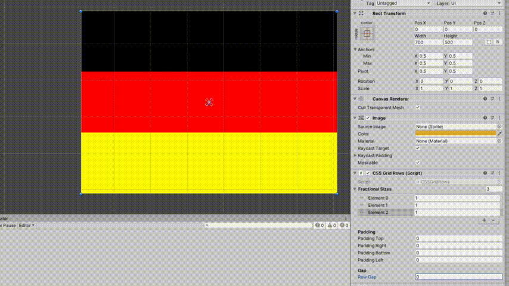

# UnityGridRowLayout

Laying out UI elements in rows, similar to CSS Grid rows.

## Download and include

Download `CSSGridRows.cs` and place it into your Unity project. On a container GameObject in the Canvas, add the CSS Grid Rows component. Add child elements under this container and set the `Flex Values` to the desired size.

## Usage

Child elements are resized dynamically, their heights are determined by their flex values. The width fills the horizontal space.

`Flex Values`: an array that contains the relative sizes of the child elements in `<flex>` values. [Read about `<flex>` values on MDN](https://developer.mozilla.org/en-US/docs/Web/CSS/flex_value). None of these values can be less than 1. There must be a flex value for every child object.

*In short: if there are two rows with flex heights of 1 and 2 respectively, the first row will take up a third of the available height: `1 / (1 + 2)`.*

`Padding`: padding inside the container object.

`Row Gap`: margin between rows.

## Demo

